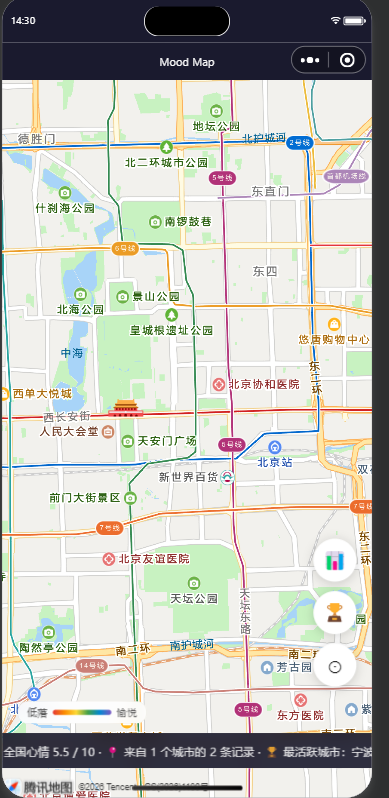
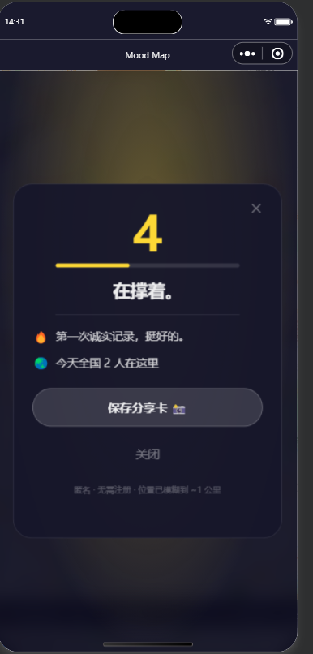
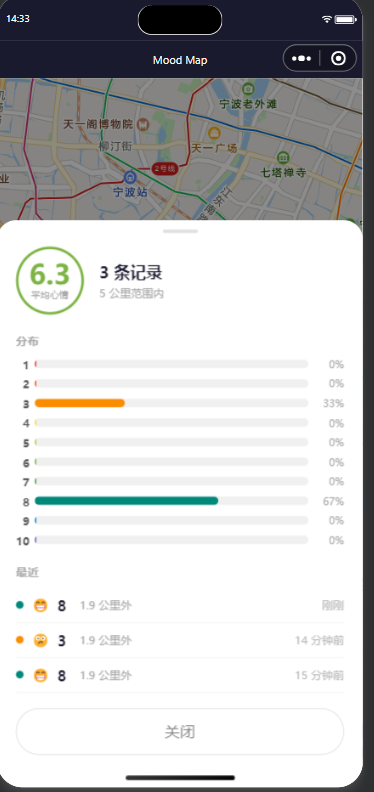
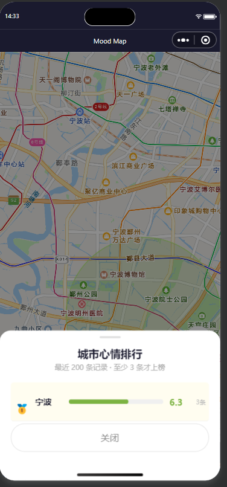

# Mood2Know

匿名提交心情（1-10），在地图上查看周边情绪分布。当前项目是本地开发版：小程序前端请求本机 Go server，数据保存在本地 JSON 文件。

## 效果图






## 项目结构

```text
mood_map_miniprogram/
├── app.js / app.json / app.wxss
├── pages/map/              小程序地图页、提交面板、统计面板
├── utils/
│   ├── api.js              本地 HTTP API 封装
│   ├── mood-color.js       情绪色板
│   ├── history.js          本地打卡历史
│   └── share.js            分享卡片生成
├── server/
│   ├── main.go             Go HTTP server
│   ├── geohash.go          geohash 编解码与邻居计算
│   └── data/               本地数据目录，已 git 忽略
├── images/
├── project.config.json
└── sitemap.json
```

## 本地运行

### 1. 启动 Go 后端

```bash
cd /home/ultraman/workspace/mood_map_miniprogram/server
go run .
```

默认地址：

```text
http://127.0.0.1:8080
```

数据文件：

```text
server/data/moods.json
```

### 2. 导入小程序

1. 打开微信开发者工具。
2. 导入项目根目录：`/home/ultraman/workspace/mood_map_miniprogram`。
3. AppID 使用你自己的 AppID，或先用测试号。
4. 在「详情 -> 本地设置」勾选「不校验合法域名、web-view、TLS 版本以及 HTTPS 证书」。
5. 点击「编译」。

### 3. 确认接口地址

[utils/api.js](utils/api.js) 默认请求：

```js
const LOCAL_API_BASE = 'http://127.0.0.1:8080';
```

开发者工具模拟器可以直接用这个地址。真机调试时要改成电脑局域网 IP：

```js
const LOCAL_API_BASE = 'http://192.168.1.23:8080';
```

## 后端接口

```text
GET  /healthz
POST /api/submitMood
POST /api/getHeatmap
POST /api/getNearbyMoods
GET  /api/getStats
```

接口返回保持小程序端使用的结构：

```json
{
  "result": {
    "ok": true
  }
}
```

快速检查：

```bash
curl http://127.0.0.1:8080/healthz

curl -X POST http://127.0.0.1:8080/api/submitMood \
  -H 'Content-Type: application/json' \
  -H 'X-Mood-Client: local-test' \
  -d '{"lat":39.9042,"lng":116.4074,"mood":7}'
```

## 测试

```bash
cd /home/ultraman/workspace/mood_map_miniprogram/server
go test ./...
```

如果 Go 构建缓存目录不可写，可以临时指定缓存目录：

```bash
GOCACHE=/tmp/moodmap-go-build go test ./...
```

## 数据行为

- `submitMood`：校验心情和坐标，按客户端 ID 做 10 分钟限流，写入本地数据文件。
- `getHeatmap`：按地图视口返回聚合后的热力格。
- `getNearbyMoods`：返回指定半径内的匿名心情记录。
- `getStats`：返回最近 200 条记录的平均值、城市数量、城市排行等。
- 记录默认保留 24 小时，服务读写时会清理过期数据。

## 常见问题

如果小程序提示网络错误：

1. 确认 `go run .` 还在运行。
2. 确认开发者工具已勾选本地请求校验豁免。
3. 模拟器用 `127.0.0.1`，真机用电脑局域网 IP。
4. 确认本机防火墙没有拦截 Go server 端口。
